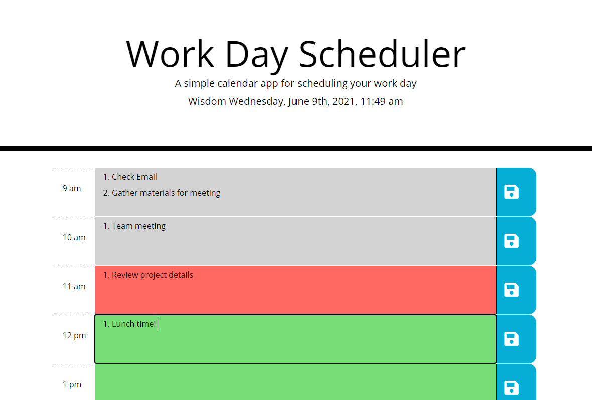

# Work Day Scheduler

[](https://opensource.org/licenses/MIT)

## Description

This web app is a helpful tool for those busy employees working the 9 to 5 shift. The app is designed to help keep the user organized and keep them on pace with their daily tasks. The website loads time block rows of each hour and the employee is able to save their notes for each hour to the page. The page can be reloaded and it pulls local storage to keep the information persistent between sessions. Moment.js was used as the time keeping API for this project which handles displaying the current date along with checking the current hour and updating the display to show what rows are in the past, present, or future. Bootstrap was also imported to the project to quickly use a grid layout for ease of development and responsive design. jQuery was loaded to use template literals to dynamically create the rows with their content to the page.

## User Story
```
AS AN employee with a busy schedule
I WANT to add important events to a daily planner
SO THAT I can manage my time effectively
```

## Live Site

https://williamcrownover.github.io/workday-scheduler/ 

#### The hours update their color based on past, present, and future


## Technologies
- Moment.js
- Bootstrap
- jQuery

## License
Licensed under the MIT License - https://opensource.org/licenses/MIT

## Contact

If you have any questions you can email me at williamcrownover1@gmail.com.


You can also check out my other work on GitHub at [WilliamCrownover](https://github.com/WilliamCrownover)